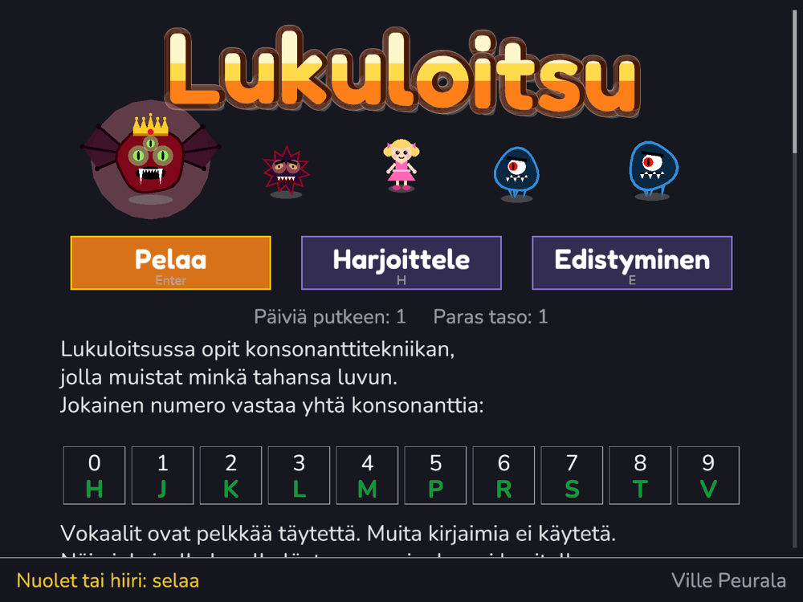
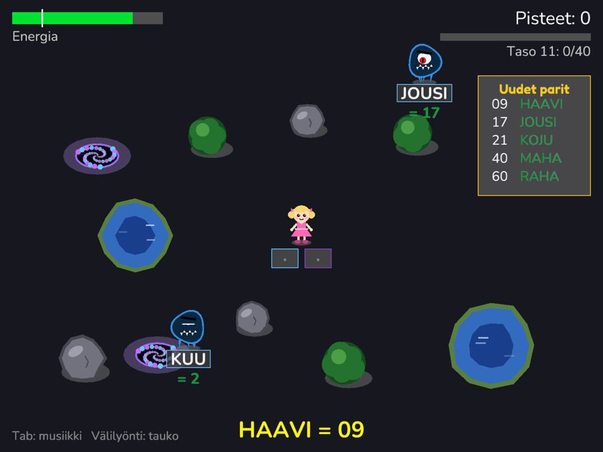
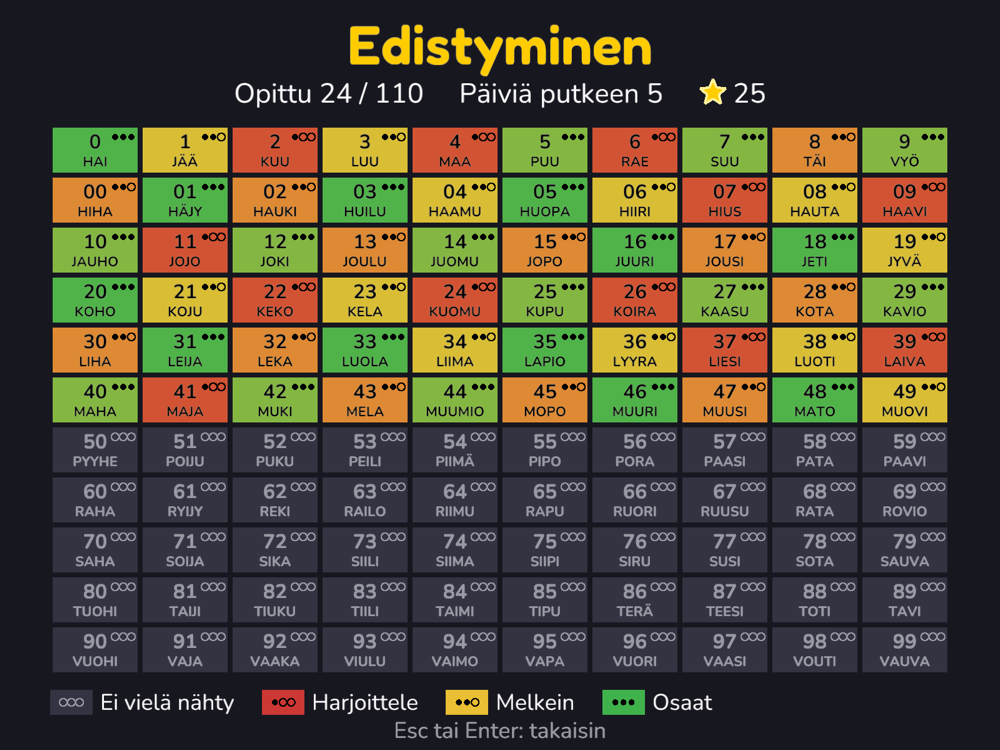

# Lukuloitsu

[](https://github.com/vpeurala/lukuloitsu.fi/actions/workflows/rust.yml)
[](https://codecov.io/gh/vpeurala/lukuloitsu.fi)
[](#license)
[](https://lukuloitsu.fi)
[](https://github.com/vpeurala/lukuloitsu.fi/tags)
[](https://github.com/vpeurala/lukuloitsu.fi/commits/main)
[](https://doc.rust-lang.org/edition-guide/rust-2024/)


A game for learning the Finnish **consonant technique** (*konsonanttitekniikka*),
the Finnish version of the Major system: a way to remember any number by
turning its digits into words.

Play it in the browser at **[lukuloitsu.fi](https://lukuloitsu.fi)**, download it
for Windows, macOS or Linux from the [releases](https://github.com/vpeurala/lukuloitsu.fi/releases)
(where the printable PDF booklet is too), or build it for Android or iOS.
The game itself is in Finnish.



## The idea

Every digit stands for one consonant:

| 0 | 1 | 2 | 3 | 4 | 5 | 6 | 7 | 8 | 9 |
|---|---|---|---|---|---|---|---|---|---|
| H | J | K | L | M | P | R | S | T | V |

Vowels are only filler, and other letters aren't used. So 22 is KEKO, 44 is
MUUMIO, 77 is SUSI. The game teaches 110 fixed number–word pairs, for 0–9 and
00–99, each with its own picture.

Longer numbers are read two digits at a time, with a single-digit word for an
odd digit left over at the end: 201 is KOHO JÄÄ, and 1377 is JOULU SUSI.

## How it plays

- **Pelaa** (Play): monsters carry numbers or words toward the heroine. Type
  the matching word or number to cast a spell at them. Each level brings a few
  new pairs and ends with a boss. Once every pair has been met, the bosses
  start carrying long numbers. A game can start from every fifth level
  reached.
- **Harjoittele** (Practice): calm flash cards, no monsters.
- **Edistyminen** (Progress): all 110 pairs coloured by how well you know them,
  with stars earned and days played in a row.

Pairs you know less well come up more often, and every pair comes back when it
is due for review (spaced repetition). Progress is saved on the device, or in
the browser's local storage on the web.

| | |
|---|---|
|  |  |
| Playing: type the matching word or number to cast a spell. | The progress map: every pair coloured by how well you know it. |

On a computer you type on the keyboard (Ä and Ö work on any keyboard layout)
and move with the arrow keys. On a phone or tablet the game shows an on-screen
keyboard and a joystick; hold the device sideways.

## Building

You need [Rust](https://rustup.rs) (stable). Everything else, including the
pictures, music and sounds, is drawn or synthesized by the code at startup.

```bash
cargo run --release
```

| Platform | How |
|---|---|
| macOS, Linux, Windows | `cargo run --release`. `scripts/macos-app.sh` makes a double-clickable `Lukuloitsu.app` for both kinds of Mac, and `scripts/linux-package.sh` a tarball; releases carry both. |
| Web | `scripts/web.sh` builds into `target/web`; `scripts/web.sh --serve` also serves it at http://localhost:8000 |
| Android | `scripts/android.sh` builds, installs and starts it on a phone connected over USB. Needs the Android SDK and NDK, Java 8 and `cargo-quad-apk` (install with `scripts/install-cargo-quad-apk.sh`); see the script for details. |
| iOS Simulator | `scripts/ios-sim.sh` (needs Xcode) |

On Linux, building needs the ALSA, X11 and OpenGL development libraries, for
example `libasound2-dev libx11-dev libxi-dev libgl1-mesa-dev` on Ubuntu.

Three extra commands:

- `cargo run -- --render-icons` regenerates the app icons for Android and iOS.
- `cargo run --release -- --render-music music.wav` writes the background music
  to a file.
- `scripts/booklet.sh` writes the user booklet, 16 A4 pages in Finnish, to
  `target/booklet/lukuloitsu-opas.pdf`. The game's own program renders it as
  HTML (`--render-booklet FILE.html`), with the pairs and pictures taken from
  the game itself, and Chrome or Chromium prints it to PDF (set `CHROME` if it
  isn't found).

Run the tests with `cargo test`. To measure test coverage, install
[cargo-llvm-cov](https://github.com/taiki-e/cargo-llvm-cov) and run
`cargo llvm-cov --summary-only`. CI reports coverage to
[Codecov](https://codecov.io/gh/vpeurala/lukuloitsu.fi) and leaves out the
files that only draw (see `.github/workflows/rust.yml`).

## How it's made

Lukuloitsu is written in Rust with [macroquad](https://macroquad.rs). A
slightly patched copy of its platform layer, miniquad, is in `vendor/`; see
[vendor/README.md](vendor/README.md).

Every push to `main` is built and tested by GitHub Actions and published to
lukuloitsu.fi by Netlify. The site counts visits and game events anonymously,
without cookies, with [GoatCounter](https://www.goatcounter.com); the apps send
nothing. The game says so itself at the end of its title screen, and
[web/tietosuoja.html](web/tietosuoja.html) (lukuloitsu.fi/tietosuoja) tells
it in more detail, in Finnish. Dependencies are kept fresh by Dependabot and
checked against the RustSec advisory database by `cargo audit` in CI.

Made by Ville Peurala.

## License

The code is licensed under either of

- [Apache License, Version 2.0](LICENSE-APACHE)
- [MIT license](LICENSE-MIT)

at your option.

The fonts in `assets/fonts` are not covered by this; they are under the SIL
Open Font License, and the licenses are next to them
([Nunito](assets/fonts/OFL-Nunito.txt),
[Fredoka](assets/fonts/OFL-Fredoka.txt)). `vendor/miniquad` keeps its own
license files.

**The word list.** The 110 number and word pairs in `src/pairs.rs` are the
author's own work, compiled over years. The list itself (the choice of a word
for each number, not the Rust code around it) is licensed under
[CC BY-SA 4.0](LICENSE-CC-BY-SA)
([summary](https://creativecommons.org/licenses/by-sa/4.0/)): you may share and
adapt it, also commercially, with credit to Ville Peurala, and adaptations must
use the same license. As the copyright holder, the author may also distribute
the game under other terms. Releases up to 0.4.4 offered the list under
CC BY-NC-SA 4.0 (non-commercial); copies received under those terms stay
under them.

**The name and the icon.** The name "Lukuloitsu", the domain lukuloitsu.fi
and the game's icon are not covered by the code licenses. You are welcome to
fork the code, but please don't publish a modified version under the name
Lukuloitsu or with its icon, or in a way that suggests it is the original or
endorsed by the author. Use a name and an icon of your own.

Unless you explicitly state otherwise, any contribution intentionally
submitted for inclusion in this project, as defined in the Apache-2.0
license, is dual licensed as above, without any additional terms or
conditions.
